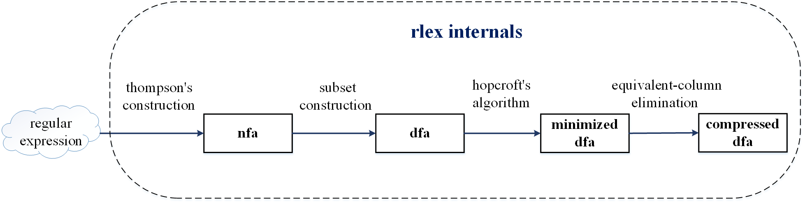

`rlex`: a clear and simple alternative to Linux `flex`
===
`rlex` is a clear and simple alternative to Linux `flex` - a tool for generating lexical analyzers (scanners). `rlex` supports the lexical rules of the C95 standard.



Usage
-----------
```
$ cd src && make
$ ./rlex
rlex 0.02 [gcc 12.2.0] [Jul 22 2025]. (c) 2025, ****. all rights reserved.
rlex: file name required

usage is: rlex [options] file
-f  for (f)ast. don't compress tables
-h  suppress (h)eader comment that describes state machine
-H  print the (H)eader only
-l  suppress #(l)ine directives in the output
-t  send output to standard output instead of lex.yy.c
-v  (v)erbose mode, print statistics
-V  more (V)erbose, print internal diagnostics as rlex runs
```


to build and run a simple word count tool (like Linux `wc`)
```
$ ./rlex ../test/wc.lex
$ gcc -o wc lex.yy.c ../lib/libl.a
$ ./wc lex.c
```

alternatively, run `make test` to build and test the `wc` example
```
$ make test
running wc (short for word count) test
generating lex.yy.c from wc.lex
./rlex ../test/wc.lex
rlex 0.02 [gcc 12.2.0] [Jul 22 2025]. (c) 2025, ****. all rights reserved.
compiling lex.yy.c into executable wc
gcc -o wc lex.yy.c ../lib/libl.a
running wc on lex.c
./wc lex.c
412     1417    11246   lex.c
```
